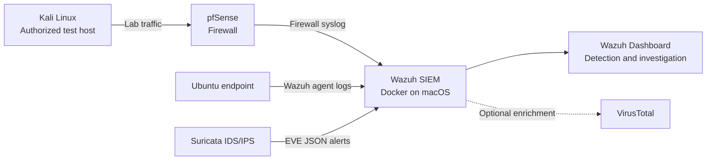

# Apple Silicon Home SOC Lab

## Visual demo

[**View the screenshots and verified demonstration →**](docs/demo/README.md)

An in-progress home Security Operations Center (SOC) lab built to develop practical skills in security telemetry collection, detection engineering, and alert investigation.

## Project goal

Build a small, segmented lab where endpoint and network telemetry is collected in **Wazuh**, investigated in a central dashboard, and validated through safe, authorized simulations.

## Architecture

## Technologies

- **Wazuh**: SIEM/XDR, log collection, rules, alerting, and investigation
- **Docker Desktop**: hosts the Wazuh deployment on Apple Silicon macOS
- **Ubuntu**: monitored endpoint and Wazuh-agent target
- **pfSense in UTM**: firewall and network-log source
- **Suricata**: IDS/IPS telemetry source
- **Kali Linux**: authorized, isolated attack-simulation host
- **VirusTotal**: optional threat-intelligence enrichment

## Current progress

- [x] Defined the SOC lab scope and high-level architecture.
- [x] Adapted the Wazuh deployment for Apple Silicon using Docker Desktop.
- [x] Generated the Wazuh deployment certificates and accessed the Dashboard.
- [x] Established Ubuntu VM host-only connectivity for administration.
- [x] Moved pfSense provisioning to UTM for Apple Silicon compatibility.
- [x] Enroll the Ubuntu endpoint as a Wazuh agent and validate events at the manager (verified September 30, 2026).
- [x] Validate SSH failed-login decoding and rule matching with a synthetic logtest input.
- [ ] Forward pfSense firewall logs to Wazuh.
- [ ] Add Suricata EVE JSON telemetry.
- [ ] Configure FIM, Sysmon, and safe detection demonstrations.

See [docs/progress.md](docs/progress.md) for the implementation log and next milestones.

## Learning outcomes

- Designing a practical, segmented security-monitoring environment
- Deploying and troubleshooting a SIEM on ARM-based hardware
- Collecting endpoint, firewall, and IDS telemetry
- Building the workflow from event generation to alert investigation
- Documenting implementation decisions, limitations, and remediation steps

## Security note

This repository intentionally excludes credentials, API keys, raw configuration files, private IP addressing, and unredacted lab notes. All attack simulations are restricted to systems I own or am explicitly authorized to test.

