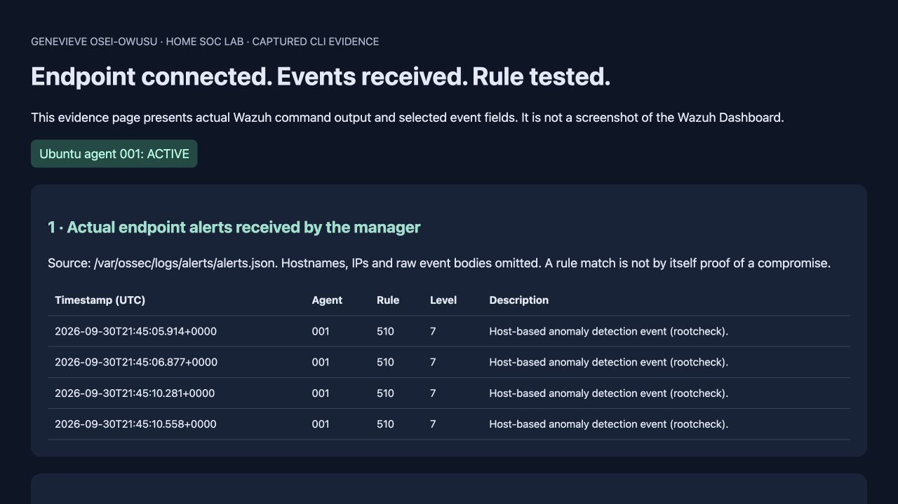
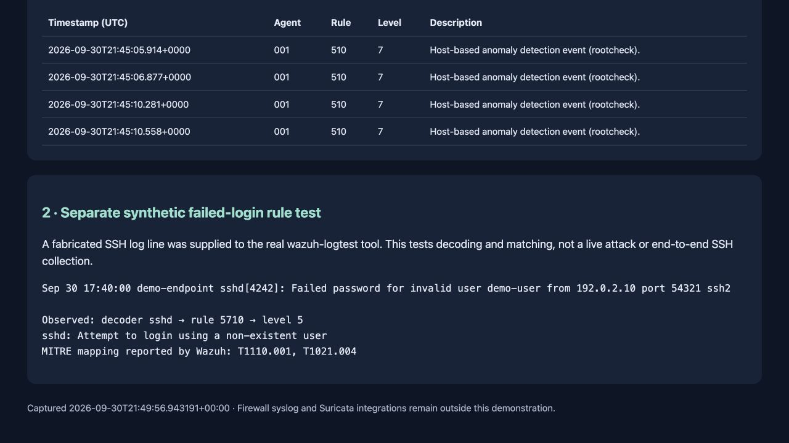

# SOC lab visual evidence

Captured from the running Wazuh 4.14.6 stack on Docker Desktop and its Ubuntu VM endpoint.

This is a **sanitized evidence view of actual backend output**, not a screenshot of the Wazuh Dashboard. The accompanying [JSON evidence](evidence.json) and [raw synthetic rule-test output](rule-test.txt) support the results shown. Hostnames, IP addresses and raw endpoint event bodies are omitted from the published endpoint evidence.

## 1. Active endpoint and received events

`agent_control -l` reported agent **001 Active** after the Ubuntu VM started. The manager’s `alerts.json` contained events for agent 001, including rootcheck rule 510 at level 7. A rootcheck rule match is not itself a confirmed compromise; these events would need investigation.



## 2. Test the SSH decoder and detection rule

A synthetic failed-login log was supplied to the real `wazuh-logtest` tool. It matched the `sshd` decoder and **rule 5710, level 5**: an attempted login using a nonexistent user. The address `192.0.2.10` is documentation-only test data.



This second test checks decoding and rule matching. It does **not** represent a live SSH attack, and it does not prove that an SSH event traveled end to end from the endpoint to the Dashboard.

### Reproduce the rule test

With the local Wazuh manager running:

```bash
printf '%s\n' 'Sep 30 17:40:00 demo-endpoint sshd[4242]: Failed password for invalid user demo-user from 192.0.2.10 port 54321 ssh2' | docker exec -i single-node-wazuh.manager-1 /var/ossec/bin/wazuh-logtest
```

Check endpoint connectivity with:

```bash
docker exec single-node-wazuh.manager-1 /var/ossec/bin/agent_control -l
```

**45-second explanation:** “I deployed Wazuh on my Apple Silicon host, connected an Ubuntu endpoint and verified alerts at the manager. I separately used a synthetic SSH log to inspect how Wazuh decodes an event and selects a rule. Firewall syslog and Suricata integration are still in progress.”

The browser dashboard screenshot is not included in this capture. No credentials, private keys or unredacted endpoint logs are published.
